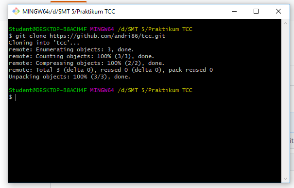
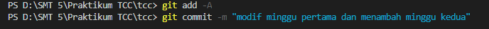
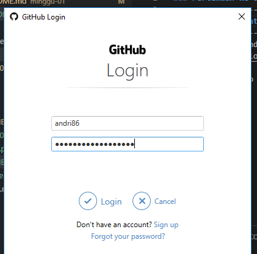
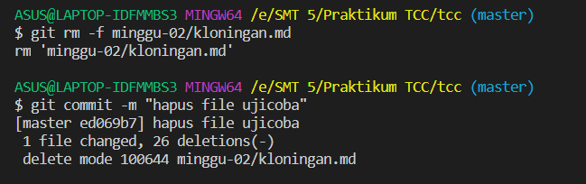
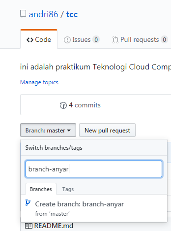
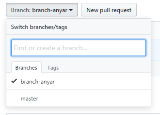
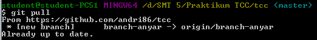
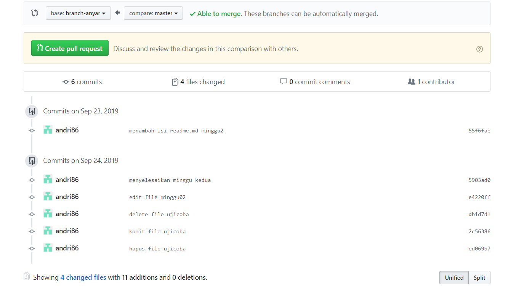

# Praktikum Teknologi Cloud
### Pertemuan ke-02
------------------------
#### Andri Siswanto/175410166
------------------------
4. Clone Repo sendiri di account sendiri

5. Mengelola Repo sendiri di account sendiri

6. Mengubah Isi dengan Branching and Merging
   
   Membuat branch baru
   
   

7. git pull untuk melihat branch yang baru saja kita buat
   
 
8. Create pull request to sync from another branch
   

