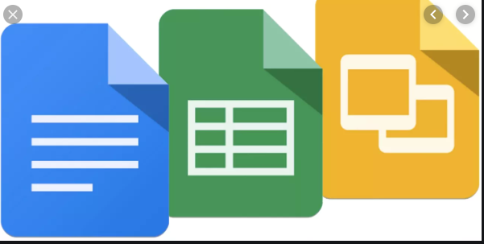
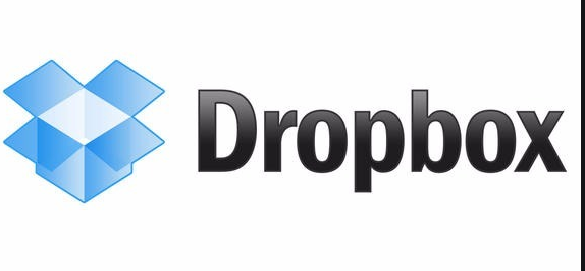
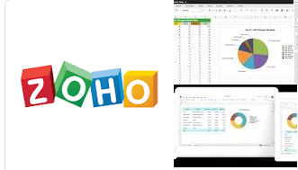
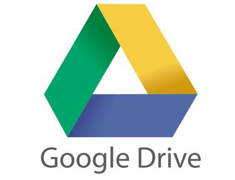
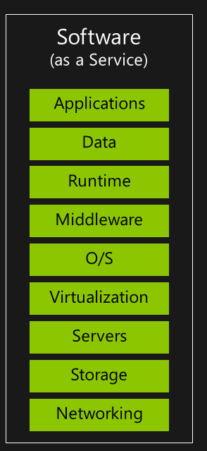

# Praktikum Teknologi Cloud
### Pertemuan ke-03
------------------------
#### Andri Siswanto/175410166
------------------------
#### * Software as a Service (SaaS) * ####

SaaS adalah sebuah layanan perangkat lunak berbasis internet yang dapat langsung digunakan oleh para penggunanya, dimana pengguna tidak perlu bersusah payah untuk melakukan instalasi server sendiri dan belajar bahasa pemrograman. Yang dibutuhkan, hanya pengguna bersedia  berlangganan dalam waktu tertentu.

Dan yang pasti, layanan Software as a service (SaaS) saat ini menjadi salah satu komponen yang penting dalam diberbagai instansi/organisasi yang didalam menjalankan kegiatannya menggunakan perangkat lunak berbasis internet.

Bagi pengguna yang tidak begitu menguasai bidang IT dan yang tidak mau direpotkan dengan hal-hal besifat  teknis, bisa mempertimbangkan untuk meggunakan layanan SaaS ini.

Berikut adalah beberapa keuntungan menggunakan layanan SaaS, yaitu antara lain :
1. Menghemat pengeluaran. Seperti yang telah disampaikan diatas, layanan ini dapat menghemat pengeluaran, karena anda tidak perlu membeli server, apabila terjadi  kendala dalam penggunaannya, bisa langsung menghubungi penyedia layanan
2. Mudah diakses. Dengan layanan SaaS ini, pengguna dapat mengakses secara real time,  dimanapun dan kapanpun berada, asal ada koneksi internet.
3. Lebih efektif dan Efisien.  Yang pasti dengan layanan SaaS, pekerjaan yang dikerjakan akan lebih efektif dan efisien, karena semua dapat diakses langsung dengan mudah, baik melalui aplikasi web atau aplikasi mobile ( sesuai dengan penyedia jasanya)
4. Mudah digunakan. Seperti yang dijelaskan diatas, dengan layanan SaaS, pengguna tidak perlu repot untuk melakukan setting server dan aplikasinya, karena semua sudah disediakan oleh penyedia layanan.
5. Lebih fleksibel. Layanan SaaS  ini memungkinkan fleksibilitas yang lebih besar dalam hal pilihan teknologi. Sekarang lebih mudah bagi pengguna untuk memilih aplikasi yang ingin mereka gunakan dan untuk menghentikan penggunaan yang tidak lagi memenuhi kebutuhan mereka.
6. Mudah diintegrasikan. Banyak penyedia layanan SaaS juga menawarkan kustomisasi layanan guna memenuhi kebutuhan pengguna yang lebih spesifik. Atau dengan kata lain, bisa menyesuaikan kebutuhan pengguna.

### * Contoh Aplikasi Saas * ###
1. Google Docs

    
2. Dropbox

    

3. Zoho Office Suite

   

4. Google Drive

   

### * Arsitektur Saas * ###

   ##### Gambar diatas adalah arsitektur dari SaaS #####

