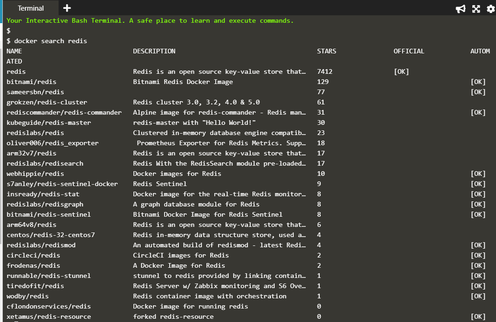
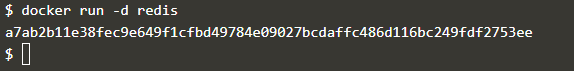
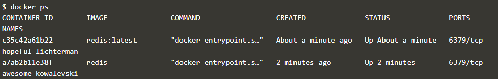
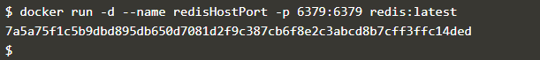

# Praktikum Teknologi Cloud
### Pertemuan ke-06
------------------------
#### Andri Siswanto/175410166
------------------------
#### * DOCKER * ####

1. Deploying Docker Container
    - Step 1-Running A Container
   

        
   
     - Step 2-Finding Running Containers
   

    - Step 3-Accessing Redis

      

