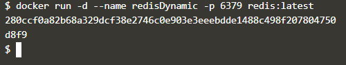
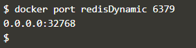
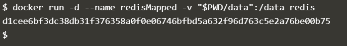
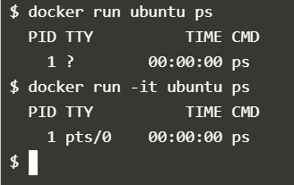

# Praktikum Teknologi Cloud
### Pertemuan ke-06
------------------------
#### Andri Siswanto/175410166
------------------------
#### * DOCKER * ####

1. Deploying Docker Container
    - Step 1-Running A Container
   

        
   
     - Step 2-Finding Running Containers
   

    - Step 3-Accessing Redis

      

    - Step 4-Accessing Redis

      

       

   - Step 5-Persisting Data

      

    - Step 6-Running A Container In The Foreground

      

   2. Deploy Static HTML Website as Container  

   - Step 1-Create Dockerfile

