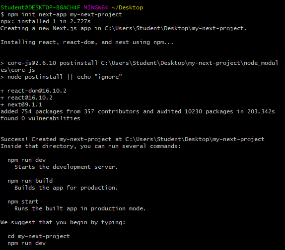

# Praktikum Teknologi Cloud
### Pertemuan ke-07
------------------------
#### Andri Siswanto/175410166
------------------------

1. Sign Up zeit
 
   
   

2. Download dan isntall node.js
 
   
   

3. npm
   PS C:\Windows\system32> npm i -g now

  > now@16.4.0 preinstall C:\Users\Student\AppData\Roaming\npm\node_modules\now
  > node ./scripts/preinstall.js

  C:\Users\Student\AppData\Roaming\npm\now -> C:\Users\Student\AppData\Roaming\npm\node_modules\now\dist\index.js
  + now@16.4.0
  added 1 package in 20.335s
  PS C:\Windows\system32>

4. Login menggunakan 'now login'
  

5. Membuat project Next.js dengan npm
  

6. Deploy App
  