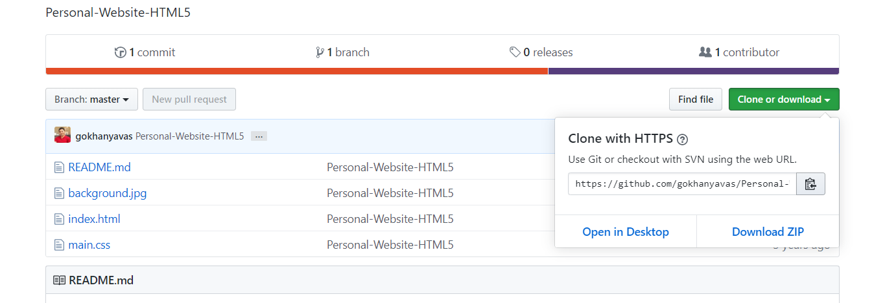
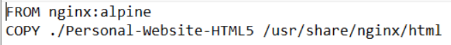
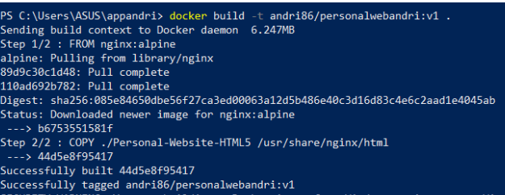
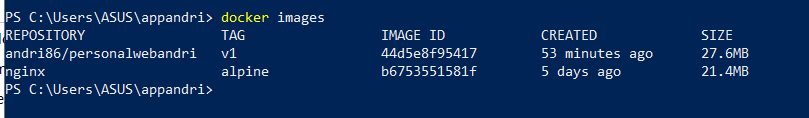
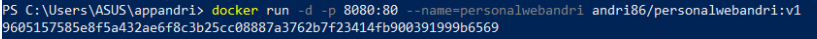
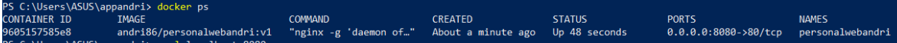
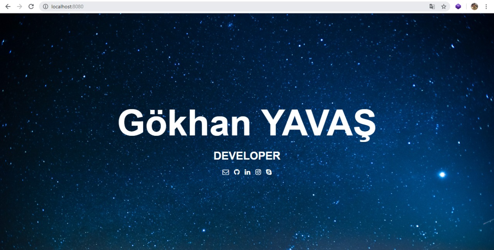
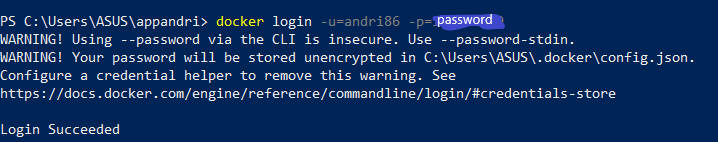
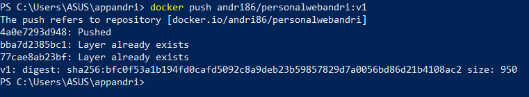
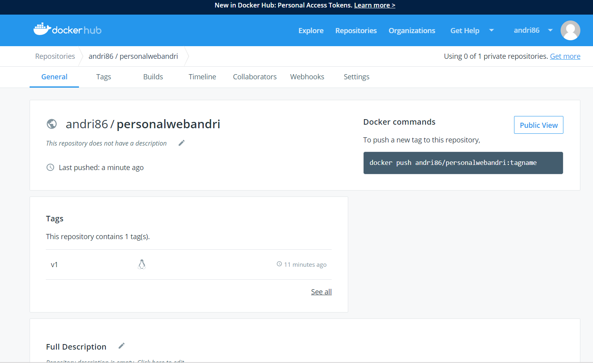

# UTS Teknologi Cloud
------------------------
#### Andri Siswanto/175410166
------------------------

1. Melakukan Download Aplikasi/web
 
   

2. Membuat File dengan nama Dockerfile
 
   
  

3. Membuat Image dari Dockerfile 

   

4. Mengecek image yang telah dibuat

    

5. Menjalankan image
  

6. Melihat container yang sedang berjalan

    

7. Melihat aplikasi/web pada browser

    

8. Mengupload ke hub.docker.com

    
    
    
